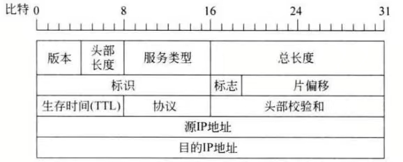

# 计算机网络第二次书面作业

### 学号：2112066    姓名：于成俊

## 习题1

### （1）根据R1的路由表信息推断并绘制出网络结构图。

因为子网掩码是255.255.240.0，所以前20位是网络号。所以我们只需列出主机B~主机E的IP地址中第三个十进制数的二进制表达，就可以判断它们的网络号。注意240的二进制形式为**1111** 0000

| 主机名称 | IP地址中第三个十进制数 | 十进制数对应的二进制形式 | 网络号      |
| -------- | ---------------------- | ------------------------ | ----------- |
| B        | 64                     | **0100** 0000            | 176.11.64.0 |
| C        | 34                     | **0010** 0010            | 176.11.32.0 |
| D        | 31                     | **0001** 1111            | 176.11.16.0 |
| E        | 60                     | **0011** 1100            | 176.11.48.0 |

由于不知道主机A和主机F的子网掩码，所以将其归为其他网络。网络结构图如下：

### （2）如果R3的E1与R2的E2的IP地址主机号均为5，那么这两个端口的IP地址是什么？

通过网络拓扑图可知：

- R3的E1的网络号为176.11.32.0，所以R3的E1的IP地址为**176.11.32.5**，子网掩码为255.255.240.0
- R2的E2的网络号为176.11.16.0，所以R2的E2的IP地址为**176.11.16.5**，子网掩码为255.255.240.0

### （3）对于目的地址为主机A~主机F的分组，它们的下一跳地址分别是什么？

根据（1）中的表格和R1的路由表就可以推断，表格如下。因为题中没有给主机A和主机F的子网掩码，所以网络号未知。

| 分组的目的主机 | 网络号      | 下一跳地址                                                   |
| -------------- | ----------- | ------------------------------------------------------------ |
| A              | 未知        | R2的E2，按（2）的结果来说就是176.11.16.5，子网掩码为255.255.240.0 |
| B              | 176.11.64.0 | R3的E1，按（2）的结果来说就是176.11.32.5，子网掩码为255.255.240.0 |
| C              | 176.11.32.0 | 直接投递，即176.11.34.72，子网掩码为255.255.240.0            |
| D              | 176.11.16.0 | 直接投递，即176.11.31.168，子网掩码为255.255.240.0           |
| E              | 176.11.48.0 | 直接投递，即176.11.60.239，子网掩码为255.255.240.0           |
| F              | 未知        | R2的E2，按（2）的结果来说就是176.11.16.5，子网掩码为255.255.240.0 |

## 习题2

### （1）Web服务器的IP地址是什么？该主机的默认网关的MAC地址是什么？

#### 答：

- Web服务器的IP地址：**64.170.98.32**
- 主机的默认网关的MAC地址：**00-21-27-21-51-EE** 

#### 解析：

从下图可知，以太网帧首部，即目的MAC地址+源MAC地址+类型一共6+6+2=**14**字节。

IP数据报是封装在以太网帧中的。从下图可知，IP数据报首部中的**目的IP地址字段**前有多个字段，共4×4=**16**字节。

因此从以太网帧的第一个字节开始数14+16=30字节，之后就是IP数据报首部中的目的IP地址字段（共4字节）。从题中可知该IP地址的十六进制形式是40 AA 62 20，转换成点分十进制形式为**64.170.98.32**。

以太网帧首部的第一个字段（长度为6B）的取值为目的MAC地址，即本题中主机的默认网关的MAC地址，为**00-21-27-21-51-EE**

### （2）该主机在构造上图的数据帧时，使用什么协议确定目的MAC地址？封装该协议请求报文的以太网帧的目的MAC地址是什么？

#### 答：

- 使用**ARP协议**确定目的MAC地址
- 封装该协议请求报文的以太网帧的目的MAC地址是**FF-FF-FF-FF-FF-FF** 

#### 解析：

ARP协议是用于解决IP地址到MAC地址的映射问题。主机在自己所在的以太网上是以广播形式发送ARP请求，ARP请求封装在以太网帧中，目的MAC地址为广播地址，所以目的MAC地址为**FF-FF-FF-FF-FF-FF**。

### （3）假设HTTP/1.1协议以持续的非流水线方式工作，一次请求/响应时间为RTT，rfc.html页面引用了5个JPG图像，则从发出上图中的Web请求开始到浏览器收到全部内容为止，需要经过多少个RTT？

#### 答：

需要经过6个RTT

#### 解析：

因为HTTP/1.1协议是建立持久连接，所以不需要每次请求都建立连接。由于题中说从发出Web请求开始，所以不算建立连接的RTT。请求Web页面，需要一个RTT；请求5个JPG图像一共需要五个RTT。所以，总共经过**6**个RTT。

### （4）该帧所封装的IP分组经过路由器R转发时，需修改IP分组首部中的哪些字段？

#### 答：

需要更改以下三个字段：

（1）**源IP地址字段**。需要把主机的私有IP地址10.2.128.100改为路由器对外的公有IP地址101.12.123.15。因为私有地址的主机要和Internet上的主机通信时，必须经过NAT设备转化为公有地址。

（2）**生存时间TTL字段**。IP数据报每经过一个路由器，生存时间TTL字段的值就减1。

（3）**校验和字段**。由于IP数据报每经过一个路由器，某些字段的值会改变（例如生存时间TTL字段的值），因此每经过一个路由器都需要重新计算首部校验和，因此校验和字段的值会改变。

